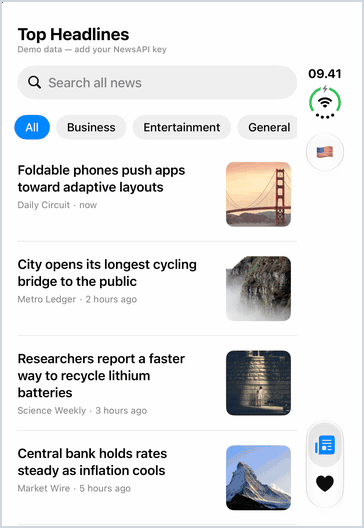
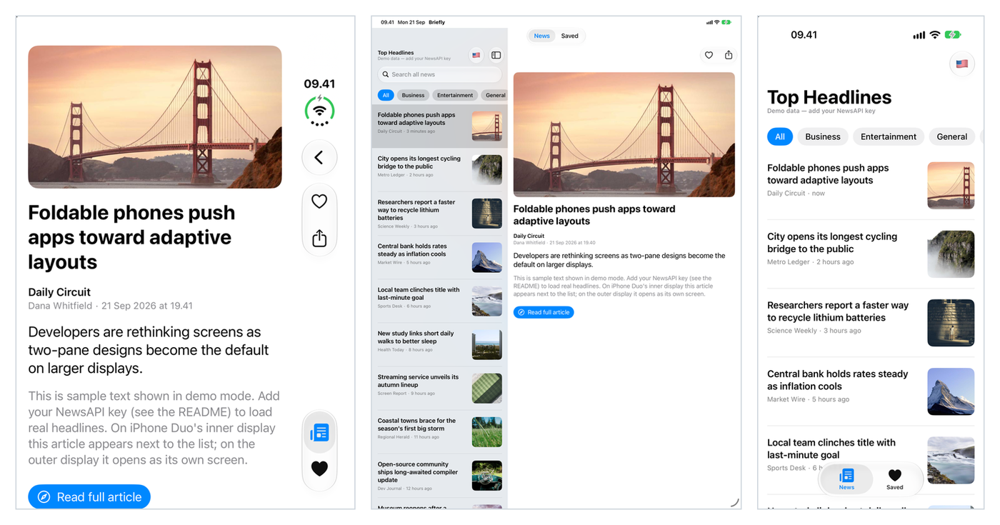
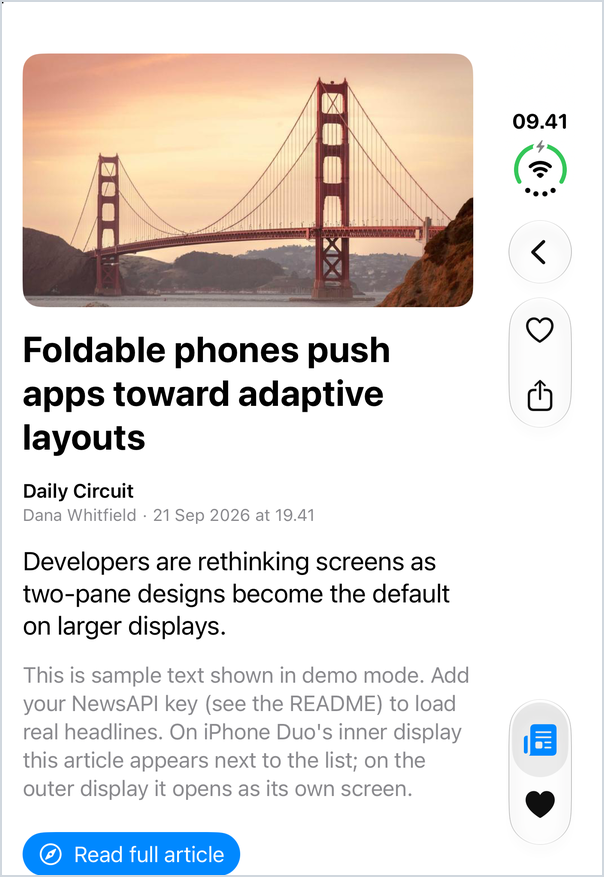
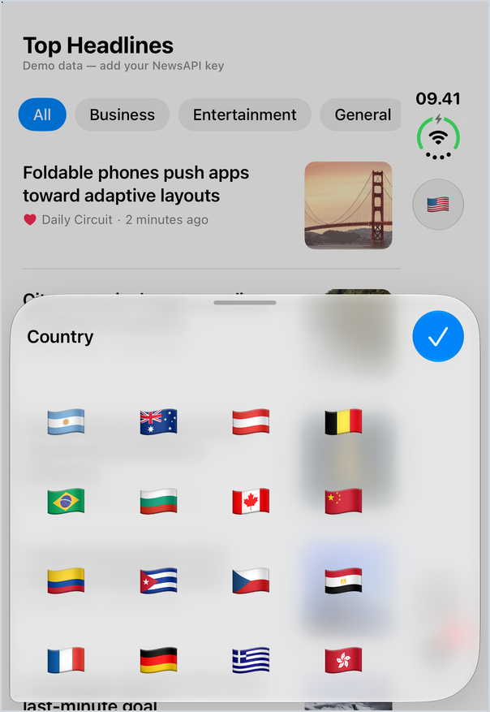
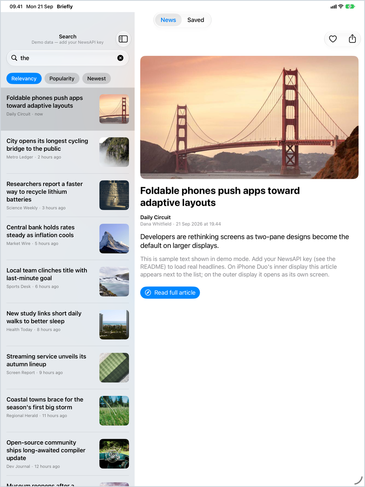
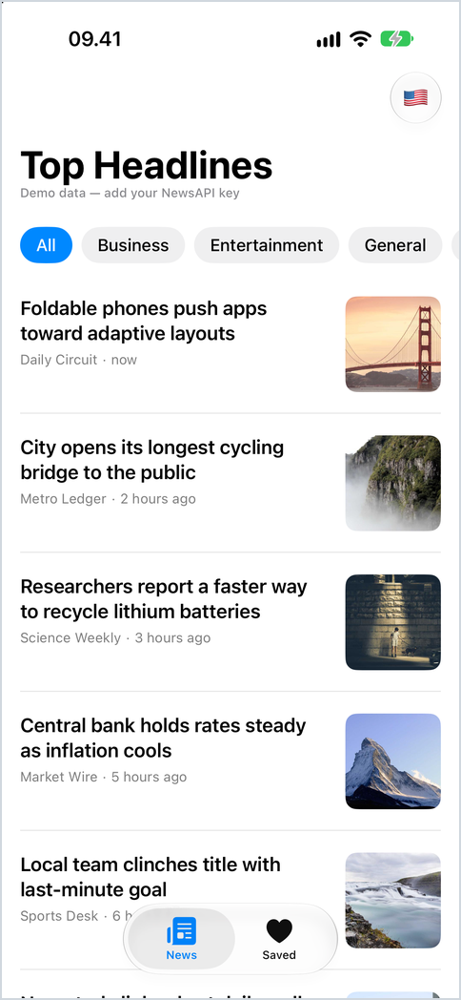

**English** | [Bahasa Indonesia](README.id.md)

# Briefly

A SwiftUI news app for **iPhone Duo** (it also runs on regular iPhones and iPads), powered by [NewsAPI](https://newsapi.org).

- **List + detail:** on Duo's inner display the list sits on the left and the article on the right. On the outer display it is a single screen with push navigation.
- **Top headlines:** pick a country (flags only) and a category.
- **Search:** search all articles, sorted by Relevancy, Popularity, or Newest.
- **Save / like:** a ❤︎ button on the list (swipe) and on the detail screen, plus a **Saved** tab. Saved articles are stored locally and readable offline.
- **Lazy load:** 10 articles per page, with a loading indicator, an error message with retry, and an end-of-list note.

**Contents**

1. [Demo](#demo)
2. [Quick start](#quick-start)
3. [How the app tells Duo mode from single screen](#how-the-app-tells-duo-mode-from-single-screen)
4. [Guide: developing for iPhone Duo](#guide-developing-for-iphone-duo)
5. [Features and how they work](#features-and-how-they-work)
6. [Architecture, NewsAPI limits, and tests](#architecture)

Other document: [docs/STRATEGY.md](docs/STRATEGY.md) explains the reasoning behind the architecture decisions (in Indonesian).

---

## Demo



*The iPhone Duo simulator's outer display: Top Headlines → open an article → save it (❤︎) → back to the list → Saved tab → country picker. The vertical bar on the right carries the tab bar and the toolbar.*



| Duo outer display: headlines | Duo outer display: article | Duo outer display: country picker |
|:---:|:---:|:---:|
|  |  |  |

| iPad Pro 13": two panes | iPad Pro 13": search + sort | iPhone: single screen |
|:---:|:---:|:---:|
|  |  |  |

About these images:

- They were captured in **demo mode**, so the headlines are fictional and the photos are stock images. No NewsAPI content is shown.
- The Duo images are the real **iPhone Duo simulator** (outer display, iOS 27.1 runtime, built with SDK 27.2).
- The **inner display could not be opened** in the simulator (see [Tooling](#1-tooling)), so the two-pane frames come from an iPad Pro 13", which has a regular-width display and goes through the same layout code.
- To reproduce: run the app with no key configured (or `NEWS_API_KEY=YOUR_NEWSAPI_KEY`).

---

## Quick start

**Requirements:** Xcode 27 (the project targets iOS 27.0). Running on the **iPhone Duo** simulator needs Xcode 27.1 or later and the Duo-specific runtime; see [Tooling](#1-tooling).

1. Open `news-duo.xcodeproj`, pick the `news-duo` scheme, and run it in a simulator.
2. Provide a NewsAPI key in one of two ways, looked up in this order (see [AppConfig.swift](news-duo/App/AppConfig.swift)):
   - the `NEWS_API_KEY` environment variable in *Edit Scheme ▸ Run ▸ Arguments*, or
   - copy [Secrets.example.plist](Secrets.example.plist) to `news-duo/Secrets.plist` and fill in the key. That file is listed in `.gitignore`, so it is never committed.
3. Without a key the app runs on **demo data** (subtitle "Demo data").

> A key compiled into an app can be extracted from the binary. For a shipped app, route requests through your own backend.

**Run the tests** (77 unit tests, Swift Testing):

```bash
xcodebuild test -project news-duo.xcodeproj -scheme news-duo -destination 'platform=iOS Simulator,name=iPhone 17' -only-testing:news-duoTests
```

The project has been built and tested with Xcode 27.0, 27.1, and 27.2 beta.

---

## How the app tells Duo mode from single screen

**No code checks "is this a Duo?".** There is no `if isDuo`, no device model check, and no second layout. There is one view hierarchy, and the **system** decides the difference through the horizontal size class, as the HIG describes (outer display = *compact width*, inner display = *regular width*).

| Display | Width | What you see |
|---|---|---|
| Duo **inner** display, iPad | regular | **Two panes**: list on the left, detail on the right |
| Duo **outer** display, regular iPhone | compact | **One pane**: the list; tapping a row pushes the detail |

All of that comes from a single component, `NavigationSplitView`, used in exactly one place.

```
                       ┌──────────────────────────┐
                       │      ArticlesSplitView   │
                       │   NavigationSplitView    │
                       └────────────┬─────────────┘
              regular width         │          compact width
     (Duo inner display, iPad)      │   (Duo outer display, iPhone)
   ┌──────────────┬───────────────┐ │ ┌──────────────┐    ┌──────────────┐
   │ ArticleList  │ ArticleDetail │ │ │ ArticleList  │ →  │ ArticleDetail│
   │ (left)       │ (right)       │ │ │ (stack root) │tap │ (pushed)     │
   └──────────────┴───────────────┘ │ └──────────────┘    └──────────────┘
    tap a row = replace right pane  │   tap a row = push, back = return
```

### Classes and functions involved

| Class / function | Role |
|---|---|
| **`ArticlesSplitView.body`** ([:17](news-duo/Presentation/Root/ArticlesSplitView.swift:17)) | The only place that chooses two panes or one. The first column (`sidebar`) holds the list; the second (`detail`, [:20](news-duo/Presentation/Root/ArticlesSplitView.swift:20)) holds the article or the "Select an Article" placeholder (visible only in two-pane mode). |
| `columnVisibility = .all` ([:14](news-duo/Presentation/Root/ArticlesSplitView.swift:14)) | On wide displays the list is always visible. No effect in compact width. |
| `.navigationSplitViewStyle(.balanced)` ([:32](news-duo/Presentation/Root/ArticlesSplitView.swift:32)) and `.navigationSplitViewColumnWidth` ([:19](news-duo/Presentation/Root/ArticlesSplitView.swift:19)) | The detail shrinks to make room for the list; the list column is 320–460 wide. |
| **`ArticleListView`**, `List(selection:)` ([:15](news-duo/Presentation/Components/ArticleListView.swift:15)) | `selection` is the contract between list and detail. Two panes: changing it swaps the right pane. One pane: changing it pushes the detail. The code is identical for both modes. |
| **`NewsFeedScreen`** ([:7](news-duo/Presentation/NewsFeed/NewsFeedScreen.swift:7)) and **`SavedScreen`** | Own the `@State selection` and pass it to `ArticlesSplitView`. Search, filter chips, and the country button live in the list column, so they appear in both modes without branching. |
| **`ArticleDetailView`** ([.toolbar :47](news-duo/Presentation/Detail/ArticleDetailView.swift:47)) | The Save/Share toolbar attaches to the detail column. `.frame(maxWidth: 720)` ([:42](news-duo/Presentation/Detail/ArticleDetailView.swift:42)) keeps text lines comfortable in a wide pane. |
| **`RootView`** ([TabView :9](news-duo/Presentation/Root/RootView.swift:9)) | A standard `TabView` (News, Saved). There is no custom tab bar. |

---

## Guide: developing for iPhone Duo

A summary of what to watch out for. Sources: Apple's [Preparing your app for iPhone Duo](https://developer.apple.com/documentation/technologyoverviews/preparing-your-app-for-iphone-duo) and the [HIG: Designing for iPhone Duo](https://developer.apple.com/design/human-interface-guidelines/designing-for-iphone-duo). API availability was checked directly in the Xcode 27.1 SDK, and anything already tried in this project is marked **(verified)**.

### 1. Tooling

**Xcode and runtime.** iPhone Duo uses its own runtime, not a regular iOS runtime:

| Runtime | Device types | Can run Duo? |
|---|---|---|
| iOS 27.1 (24A94401) | only **iPhone Duo** | **Yes** |
| iOS 27.0 and iOS 27.2 (regular) | 62 types (iPhones, iPads) | **No**: creating a Duo device is rejected (`Incompatible device`) |

This was verified on the development machine. With Xcode 27.1, `xcodebuild -downloadPlatform iOS` downloads the Duo runtime (about 7.9 GB). With Xcode 27.2 the same command downloads the regular 27.2 runtime (8.2 GB), which does **not** run Duo.

Create a device:

```bash
xcrun simctl create "iPhone Duo" com.apple.CoreSimulator.SimDeviceType.iPhone-Duo com.apple.CoreSimulator.SimRuntime.iOS-27-1
```

Because the project's deployment target is 27.0, the app may be built with a newer SDK (27.1 or 27.2) and run on the Duo 27.1 runtime. **(verified)**

**Two displays, one simulator.** Duo has two displays. In the simulator they show up as separate framebuffers (outer about 1398×2034 px, inner 2007×2853 px). The inactive one shows **black**, so do not mistake it for a crashed app:

```bash
xcrun simctl io <udid> enumerate                                # list display ports with their UUIDs
xcrun simctl io <udid> screenshot --display=<port-UUID> out.png # capture one display
```

Port UUIDs change after the simulator reboots, so run `enumerate` again.

**Poses (closed, open, partially folded) are set from Device Hub only.** `simctl` has no command for it. In the Device Hub of Xcode 27.2 beta I could **not find the control** **(verified)**:

- The Device, Controls, and View menus, the toolbar, the "…" menu, and the Settings/Info inspectors contain no fold or open command.
- The toolbar icon that looks like a window with a small panel is **Resize Mode**. It only resizes the scene; bars stay horizontal, so it does not reproduce the Duo pose.
- Rotate (⌘←/⌘→) turns the outer display to landscape and never lights the inner display.
- The bump on the right edge of the device image is the **side button**; dragging it locks the device.
- Xcode 27.1's Device Hub showed extra device-shaped icons in the bottom bar that may be pose selectors. This is not verified.

Device Hub lives at `Xcode.app/Contents/Applications/DeviceHub.app`. The two-arrow icon at the top right of its small window expands it to the full layout (device list, toolbar, inspectors).

**API availability.** Some Duo APIs only exist from iOS 27.1, while this project's deployment target is 27.0, so wrap them in `#available(iOS 27.1, *)`:

| API | Availability |
|---|---|
| `visibilityPriority`, `presentationPlacement`, `ToolbarOverflowMenu` | iOS 27.0 |
| `toolbarVerticalBehavior`, `toolbarVerticalCompressionBehavior`, `axisBehavior`, `toolbarVerticalEdge` | iOS 27.1 |
| `ArrangementView`, `GeometryProxy.reservedRegions(...)` | iOS 27.1 |

Build with Xcode 26 or later so content uses the whole screen (including under the status bar and camera).

### 2. Layout rules

- **Adapt, do not target devices.** Use size classes. Do not decide layout from `userInterfaceIdiom` or orientation; Apple explicitly lists both as things to avoid.
- **Measure from the container, not the screen.** Compute layout from the scene or containing view bounds. Avoid fixed widths and heights.
- **Prefer system containers:** `NavigationSplitView`, `TabView`, `NavigationStack`, and `ArrangementView`. They adapt to the outer display, the inner display, and the fold on their own. That is why this app has no Duo-specific layout.
- **Content gets less width on the outer display.** There, the clock, signal, tab bar, and toolbar move to a vertical column on the right **(verified)**, so the content area narrows. Do not rely on the full screen width.
- **Scrolling content does not need to move away from the fold.** Feeds, documents, and lists already adapt by scrolling.
- **Grids: use an even number of columns** so the fold divides them cleanly (HIG advice).
- **Change only what is needed.** Move only the elements that must move, and keep text and control sizes consistent when a view is resized.

### 3. Vertical bars (the part most often missed)

Bars (navigation bar, toolbar, tab bar) present **vertically** on the outer display when closed, and in some contexts on the inner display:

| Context | Bar presentation |
|---|---|
| Outer display (closed) | vertical |
| Split view: sidebar / content | horizontal |
| Split view: **detail** | **vertical** |
| Inspector | horizontal |
| Sheet on the outer display | vertical by default (turn off with `toolbarVerticalBehavior`) |
| Sheet on the inner display | center/leading horizontal; trailing vertical (set with `presentationPlacement`) |

Rules to follow:

- **Every toolbar item needs an icon *and* a title.** Vertical bars show icons only. According to Apple, **title-only** items and **custom-view** items are not shown in a vertical bar. The title is still used in the overflow menu and by VoiceOver.
- **Attach `.toolbar` to a `NavigationStack` or `NavigationSplitView`.** Do not build custom bars from `UIToolbar`, `UINavigationBar`, or `UITabBar`.
- **Order the items.** The top of the vertical axis is for primary navigation (Back, Close), followed by prominent actions (Done). Use `ToolbarItemPlacement.topBarPinnedTrailing` for prominent navigation items and `.cancellationAction` for a custom Back/Close.
- **Manage overflow.** Vertical bars have limited room. Give items a `visibilityPriority` so important ones stay out of the overflow menu, or add your own `ToolbarOverflowMenu`. Navigation-focused apps keep the tab bar and move toolbar items to overflow (the default); task-focused apps can change this with `toolbarVerticalCompressionBehavior`.
- **Hero images** that should reach under a vertical bar: use `backgroundExtensionEffect()`. To know whether a bar is currently vertical inside a custom view, read the `toolbarVerticalEdge` environment value.

Example from this project, [ArticleDetailView.swift:47](news-duo/Presentation/Detail/ArticleDetailView.swift:47): an icon and a title on every item, with Save outranking Share:

```swift
.toolbar {
    ToolbarItem(placement: .primaryAction) {
        Button { Task { await saved.toggle(article) } } label: {
            Label(isSaved ? "Saved" : "Save", systemImage: isSaved ? "heart.fill" : "heart")
        }
    }
    .visibilityPriority(.high)

    ToolbarItem(placement: .primaryAction) {
        ShareLink(item: article.url) { Label("Share", systemImage: "square.and.arrow.up") }
    }
    .visibilityPriority(.low)
}
```

**Pitfalls found in this project (verified):**

- **A `Text` icon is ignored.** A toolbar only treats an `Image` as a `Label` icon. An emoji as `Text` shows as text in a horizontal bar but gives a vertical bar nothing to display.
- **The toolbar forces `Image` to template rendering.** A colored icon (for example a flag) turns into a black silhouette. SwiftUI's `.renderingMode(.original)` is not honored; what works is marking the `UIImage` itself `.alwaysOriginal`. See [FlagIcon.swift](news-duo/Presentation/Components/FlagIcon.swift), used by the country button in [NewsFeedScreen.swift](news-duo/Presentation/NewsFeed/NewsFeedScreen.swift).
- **Sheets follow vertical bars on the outer display.** The "Done" button in [CountryPickerView.swift](news-duo/Presentation/Components/CountryPickerView.swift) deliberately has a `checkmark` icon.

### 4. Fold and camera: *reserved regions*

When Duo is partially folded, the inner display is split by the **fold**. The camera covers part of the screen (**occlusion**). iOS models both as *reserved regions*:

| Kind | Meaning | Active when |
|---|---|---|
| `division` | the fold splits a large view | only when partially folded |
| `occlusion` | the camera covers content | outer camera always; inner camera only while in use |

Each region has a `frame`, `margins`, and an active or inactive state (queries can include inactive ones). In SwiftUI:

```swift
GeometryReader { proxy in
    let regions = proxy.reservedRegions(kind: ..., options: ..., layoutDirectionBehavior: ...)
    // position views based on regions[i].frame
}
```

**When to use it:** only for custom layouts that must avoid the fold or camera by hand. System containers (split view, tab bar, navigation stack, arrangement view) already adapt on their own. This project does not use it. It does not use `ArrangementView` (`.split` or `.overlay` style) either; Apple advises against placing it inside a `NavigationSplitView`, `List`, or `ScrollView`.

### 5. Test checklist

From Apple's checklist, walk through **every screen, sheet, and popover** in every orientation and pose (closed, open, partially folded):

- [ ] Views resize well as the device opens, closes, and rotates.
- [ ] Bars look right when vertical: no missing items, and the overflow order makes sense.
- [ ] Sheets and popovers do not jump around when the device folds or unfolds.
- [ ] No important control or element lands in the fold, where it is hard to see and touch.
- [ ] **State survives** moving between displays: selected article, scroll position, search text, filters. Not yet tested in this project.

### 6. Verification status of this project

| Done | Not done |
|---|---|
| Outer display (closed) in the Duo simulator: tab bar and toolbar (flag) appear in the vertical bar on the right, single-column list, live data; the content reaches all four screen edges with no letterboxing | Inner display (open): the two-pane list + detail. **No control to open the simulated device was found** in Device Hub (Xcode 27.2 beta); see [Tooling](#1-tooling) |
| Save/Share, Done, and the country button use icon + title | Partially folded pose and behavior around the fold |
| Built with Xcode 27.0, 27.1, and 27.2 beta; 77 tests pass on the Duo simulator | Detail pane as a vertical bar on the inner display; sheets on the inner display |
| | State continuity when moving between displays |
| | The country grid uses adaptive columns (`.adaptive(minimum: 64)`), not confirmed to be an even count, so the fold may not divide it cleanly |

Until the inner display can be opened, an iPad Pro 13" (regular width) is the closest stand-in: it already shows the two-pane list + detail correctly.

---

## Features and how they work

### Filter and search

| Condition | Endpoint | Control |
|---|---|---|
| Search is empty | `/top-headlines` | flag button (`CountryPickerView`) + category chips |
| Search submitted | `/everything` | sortBy chips |

Search runs on **submit**, not on every keystroke, because NewsAPI's developer plan is limited to 100 requests per day. Flags are built from ISO country codes as emoji ([DisplayNames.swift](news-duo/Presentation/Components/DisplayNames.swift)), with no dependency.

### Lazy load (10 per page)

Logic in [NewsFeedViewModel](news-duo/Presentation/NewsFeed/NewsFeedViewModel.swift), UI in [NewsFeedScreen](news-duo/Presentation/NewsFeed/NewsFeedScreen.swift).

| Part | Function |
|---|---|
| Page size | `NewsFeedViewModel.defaultPageSize = 10` |
| Trigger | `loadMoreIfNeeded(after:)`: when the **last** row appears, fetch the next page via `loadMore()` |
| First page | `loadFirstPage(clearingContent:)`: initial load, pull-to-refresh, and filter changes |
| Stale responses | a `generation` counter: responses to an older query are discarded |
| Plan limit | `maximumResultsReached` is treated as the end of the list, not an error |

The row after the last article (`footerState`, `loadMoreFooter` at [NewsFeedScreen.swift:147](news-duo/Presentation/NewsFeed/NewsFeedScreen.swift:147)):

| State | What is shown |
|---|---|
| `.loading` | spinner + "Loading more…" |
| `.failed(reason)` | a warning icon + the **reason** (for example "You appear to be offline…") + a **Try Again** button. Already-loaded articles stay; scrolling again does not retry automatically. |
| `.endOfList(message)` | "You're all caught up." (or the plan-limit message) |
| `.hidden` | no row |

Other states: initial load (centered spinner), initial load failure (`ContentUnavailableView` + reason + Try Again), empty results (message depends on search or headlines), and refresh failure while content is showing (an alert; the old content stays). Article images ([RemoteImageView](news-duo/Presentation/Components/RemoteImageView.swift)): a spinner while downloading, `photo.badge.exclamationmark` on failure, and `photo` when there is no URL.

---

## Architecture

Clean Architecture; dependencies only point inward: `Presentation → Domain ← Data`.

```
news-duo/
├── App/            AppContainer (composition root), AppConfig (looks up the API key)
├── Domain/         Entities (Article, ArticleQuery, Country, ...), repository protocols, use cases
├── Data/           Network (endpoint, HTTP), DTO + mapper, repositories (NewsAPI, demo, file JSON)
└── Presentation/   Root, NewsFeed, Saved, Detail, Components
```

Data flow: `View → ViewModel → UseCase → Repository (protocol) → Data → NewsAPI / JSON file`. Saved articles are stored as a single JSON file in `Application Support` ([FileSavedArticlesRepository](news-duo/Data/Repositories/FileSavedArticlesRepository.swift)), so they are readable offline but not synced across devices.

## NewsAPI limits

Checked with the developer plan on 2026-09-20:

- `top-headlines` only returns data for `us`; other countries return 0 results without an error (the app shows an empty state). So the country picker is of little use with this key.
- `everything` can return short or empty pages (especially Popularity), so `hasMore` is computed from `totalResults`, not from the number returned.
- Searching without a language filter returns articles in every language.
- At most 100 results per query and 100 requests per day.

## Tests

77 unit tests (Swift Testing) cover the DTO mapper, endpoint, repository (HTTP stubbed), file storage, use cases, and the view models (paging, filters, search, footer, stale responses). There are no automated UI tests.
